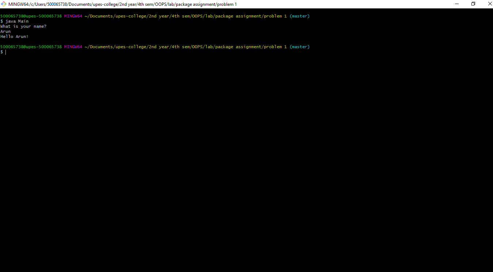
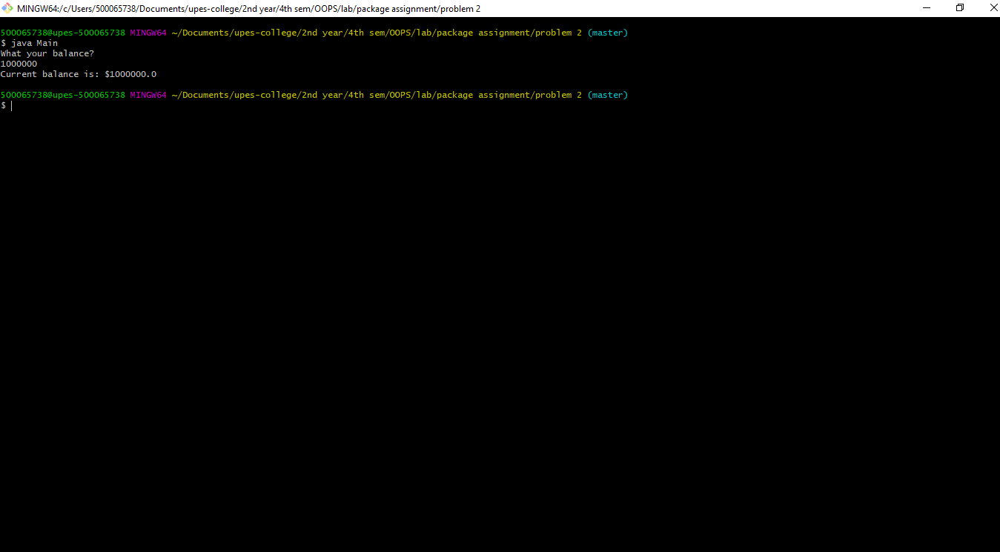

# Student Details

Name: Arunachalaeshwaran V R

Roll no.: R177218025

SAP-ID: 500065738

# Problem 1

Q. Write a Java program to implement the concept of importing classes from user defined package and created packages.

# Problem 2

Q. Write a program to make a package Balance. This has an Account class with Display_Balance method. Import Balance package in another program to access Display_Balance method of Account class. 

